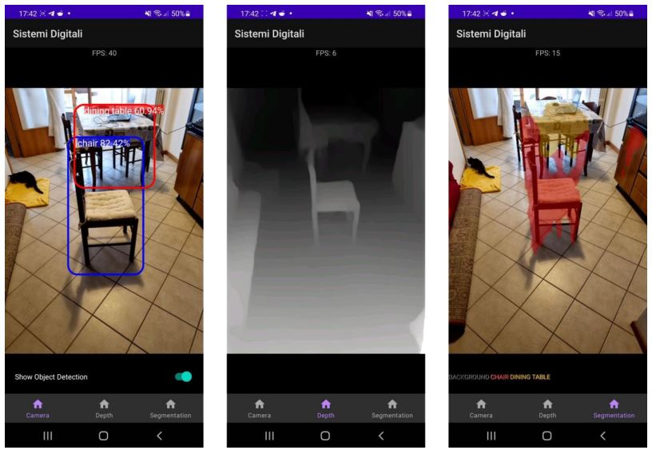

# Project for Sistemi digitali
This project was made for the exam of Sistemi digitali at Università di Bologna.

## Introduction

The developed application serves as a "prototype" tool to support visually impaired individuals. Its main objective is to analyze the environment captured by the smartphone camera and notify the user of the proximity of an object to the camera through an audio signal that activates when the identified object is close to the phone. In addition to this, the user can send voice commands to the application by long-pressing the screen. These commands allow the user to enable or disable the audio signal, adjust its volume, and change the triggering distance of the signal.

Other functionalities of the application were added for "academic" purposes (retained from a previous version of the app that was later modified). These include the ability to perform semantic segmentation of the scene captured by the camera and to construct depth maps of the frames of the scene itself.

Read the full project report [here](<Report Progetto Matteo Giri.pdf>) (in Italian).
